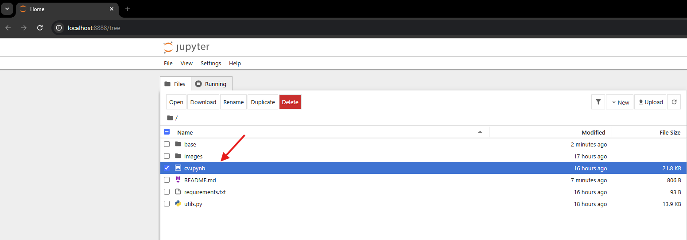
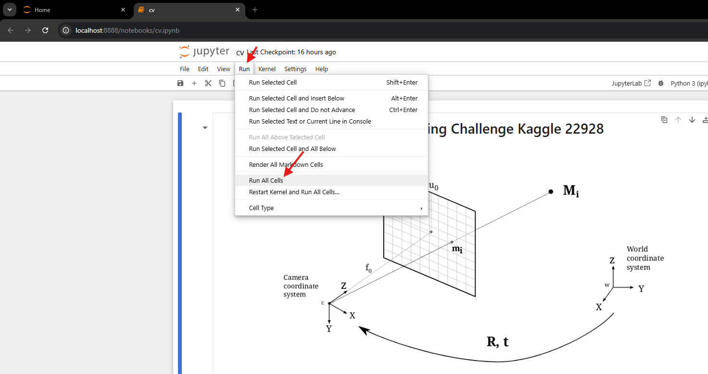

# How to run notebook

1. **Create a Virtual Environment**:
   - For macOS/Linux Terminal:
     ```bash
     python3 -m venv base
     ```
   - For Windows CMD:
     ```cmd
     python -m venv base
     ```

2. **Activate the Virtual Environment**:
   - On macOS/Linux Terminal:
     ```bash
     source base/bin/activate
     ```
   - On Windows CMD:
     ```cmd
     .\base\Scripts\activate
     ```

3. **Install Dependencies**:
    ```bash
    pip install -r requirements.txt
    ```

4. **Run Jupyter Notebook**:
    ```bash
    jupyter notebook
    ```

Open existing `cv.ipynb` jupyter notebook, click on `Run` on menu bar
and finally click `Run All Cells` (see the following images)

Note: in last cell you can choose what mode you to run the notebook on:
1. `train`
2. `test`

```
mode = "train"
submission = prediction(mode)
submission.to_csv('submission.csv', index=False)
```

<center></center>
<center></center>

